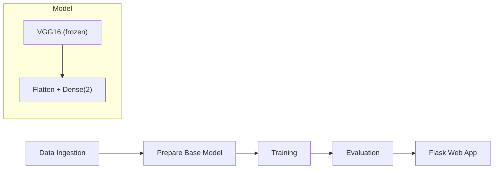

# 🐔 Chicken Disease Classification

An end-to-end deep learning pipeline that classifies chicken fecal images as **Healthy** or **Coccidiosis** using transfer learning with VGG16.

---

## Table of Contents

- [About the Project](#about-the-project)
- [Problem, Process & Learnings](#problem-process--learnings)
- [Architecture](#architecture)
- [Project Structure](#project-structure)
- [Quick Start](#quick-start)
- [Pipeline Stages](#pipeline-stages)
- [Configuration](#configuration)
- [Web Interface](#web-interface)
- [API Reference](#api-reference)
- [Deployment](#deployment)


---

## About the Project

Coccidiosis is a parasitic disease that affects poultry worldwide, causing significant economic losses. Early detection through fecal image analysis can help farmers take timely action. This project builds a complete ML system — from data ingestion to a deployable web app — that automates this classification task.

**Tech stack:** TensorFlow/Keras · Flask · Docker · GitHub Actions

---

## Problem, Process & Learnings

### What Problem the Project Solves

Manual inspection of chicken fecal samples for disease indicators is slow, subjective, and requires trained personnel. This project automates coccidiosis detection by training a convolutional neural network on fecal images, enabling fast, consistent, and scalable screening. Farmers or veterinary staff simply upload a photo through the web interface and receive an instant healthy/diseased classification.

### Key Implementation Steps

1. **Data Ingestion** — Automated download and extraction of the labeled fecal image dataset (439 images across 2 classes: Coccidiosis and Healthy).
2. **Base Model Preparation** — Loaded a VGG16 model pre-trained on ImageNet, froze all convolutional layers, and appended a custom classification head (Flatten → Dense with softmax).
3. **Training with Augmentation** — Trained the model using an 80/20 train/validation split with real-time data augmentation (rotation, flipping, shifting, shearing, zooming) to combat the small dataset size.
4. **Evaluation & Metrics** — Evaluated the trained model on a held-out validation set and persisted loss/accuracy scores to `scores.json`.
5. **Web App & Deployment** — Built a Flask web app with a drag-and-drop UI for image upload and prediction, containerized with Docker, and set up CI/CD pipelines for AWS (ECR + EC2) and Azure deployments.

### Challenges We Faced

- **Small dataset** — With only ~439 images, overfitting was a primary concern. We mitigated this with aggressive data augmentation and by freezing the pre-trained VGG16 layers.
- **Transfer learning tuning** — Deciding which layers to freeze vs. fine-tune required experimentation. Freezing all VGG16 layers and only training the classification head gave the best results for this dataset size.
- **Base64 image pipeline** — The web interface converts uploaded images to base64 for transport to the Flask backend. Getting consistent image decoding, resizing, and normalization across the browser and TensorFlow preprocessing pipeline required careful alignment.
- **Reproducibility** — Ensuring the full pipeline (download → train → evaluate) could be reliably reproduced across environments required careful configuration management and a modular pipeline architecture.
- **Keras 3 optimizer compatibility** — When loading a saved HDF5 model in TensorFlow 2.21+/Keras 3, the bundled optimizer holds stale variable references. Training crashes with `Unknown variable` errors unless you recompile the model with a fresh optimizer after loading.
- **Implicit runtime dependencies** — TensorFlow does not declare `Pillow`, `scipy`, or `tensorboard` as hard install dependencies, yet they are required at runtime for image loading, data augmentation, and the TensorBoard callback respectively. We discovered each through sequential runtime crashes — a reminder that `pip install tensorflow` alone is not enough.
- **Epoch sensitivity** — Training for just 1 epoch produced coin-flip accuracy (50%). Increasing to 20 epochs jumped evaluation accuracy to **94%**, highlighting how critical epoch count is even when only training a small classification head.
- **Subtle layer-freezing bug** — The original codebase had `model.trainable = False` inside a `for layer in model.layers` loop, which toggled the entire model's flag repeatedly instead of freezing individual layers (`layer.trainable = False`). This silent bug meant layers were not being frozen as intended.

### What We Learned

- **Modular ML project structure** — Separating concerns into entities, configuration managers, components, and pipeline stages makes the codebase maintainable and each stage independently testable.

- **Transfer learning effectiveness** — Even with a very small dataset, a frozen VGG16 backbone with a simple classification head achieves reasonable accuracy, demonstrating the power of pre-trained features.
- **End-to-end thinking** — Building from notebook experimentation all the way to a Dockerized, CI/CD-deployed web app taught us the full lifecycle of an ML project beyond just model training.
- **Aggressive dependency trimming requires runtime validation** — Removing packages based on source-code grep is not sufficient. Some dependencies (like `Pillow`, `scipy`) are implicit requirements of your main packages, only discovered when you actually run the code. Always validate a clean install by running the full pipeline.
- **Keras 3 migration pitfalls** — Keras 3 changed model serialization behavior significantly. HDF5 saves are now considered legacy, optimizer state handling differs, and `model.compile()` must be called after `load_model()` to bind a fresh optimizer to the new variable instances.
- **Epoch count is the cheapest accuracy lever** — With a frozen backbone and small dataset, going from 1 → 20 epochs improved accuracy from 50% to 94%. Before adding model complexity or data, simply training longer is often the highest-ROI change.

---

## Architecture



The pipeline is triggered via `python main.py`. The trained model is served through a Flask web application.

---

## Project Structure

```
├── app.py                     # Flask web server
├── main.py                    # Run full training pipeline
├── params.yaml                # Hyperparameters
├── config/config.yaml         # Paths and artifact locations

├── scores.json                # Evaluation metrics
├── requirements.txt           # Python dependencies
├── Dockerfile                 # Container definition
├── setup.py                   # Package setup
├── templates/
│   └── index.html             # Web UI
├── research/                  # Jupyter notebooks (experimentation)
│   ├── 01_data_ingestion.ipynb
│   ├── 02_prepare_base_model.ipynb
│   ├── 03_prepare_callbacks.ipynb
│   ├── 04_training.ipynb
│   └── 05_model_evaluation.ipynb
└── src/cnnClassifier/
    ├── __init__.py             # Logger setup
    ├── constants/              # File path constants
    ├── entity/                 # Dataclass configs
    ├── config/                 # Configuration manager
    ├── components/             # Core ML logic
    │   ├── data_ingestion.py
    │   ├── prepare_base_model.py
    │   ├── prepare_callbacks.py
    │   ├── training.py
    │   └── evaluation.py
    ├── pipeline/               # Stage orchestrators
    │   ├── stage_01_data_ingestion.py
    │   ├── stage_02_prepare_base_model.py
    │   ├── stage_03_training.py
    │   ├── stage_04_evaluation.py
    │   └── predict.py
    └── utils/
        └── common.py           # YAML, JSON, image utilities
```

---

## Quick Start

### Prerequisites

- Python 3.8+
- pip

### Setup

```bash
# Clone the repository
git clone https://github.com/thegreatone9/Chicken-Disease-Classification-Projects.git
cd Chicken-Disease-Classification-Projects

# Create a virtual environment (recommended)
python -m venv venv
source venv/bin/activate  # Windows: venv\Scripts\activate

# Install dependencies
pip install -r requirements.txt
```

### Train the Model

```bash
python main.py
```

This runs all 4 pipeline stages: data download → model preparation → training → evaluation.

### Run the Web App

```bash
python app.py
```

Open [http://localhost:8080](http://localhost:8080) in your browser.

---

## Pipeline Stages

| # | Stage | Description | Output |
|---|-------|-------------|--------|
| 1 | **Data Ingestion** | Downloads and extracts the chicken fecal image dataset | `artifacts/data_ingestion/` |
| 2 | **Prepare Base Model** | Loads VGG16, freezes layers, adds classification head | `artifacts/prepare_base_model/` |
| 3 | **Training** | Trains with augmentation, saves best checkpoint | `artifacts/training/model.h5` |
| 4 | **Evaluation** | Evaluates on validation set, saves metrics | `scores.json` |

---

## Configuration

### Hyperparameters (`params.yaml`)

| Parameter | Default | Description |
|-----------|---------|-------------|
| `IMAGE_SIZE` | `[224, 224, 3]` | Input image dimensions (VGG16 default) |
| `BATCH_SIZE` | `16` | Training batch size |
| `EPOCHS` | `1` | Number of training epochs |
| `LEARNING_RATE` | `0.01` | SGD learning rate |
| `AUGMENTATION` | `True` | Enable data augmentation |
| `CLASSES` | `2` | Number of output classes |
| `WEIGHTS` | `imagenet` | Pre-trained weights source |
| `INCLUDE_TOP` | `False` | Exclude VGG16 classification layers |

### Paths (`config/config.yaml`)

All artifact paths (data, models, checkpoints, TensorBoard logs) are defined in `config/config.yaml`.

---

## Web Interface

The web app provides a minimal drag-and-drop interface:

1. **Upload** a chicken fecal image (drag or browse)
2. **Click Predict** to classify
3. **View the result** — displayed as "Healthy" (green) or "Coccidiosis" (red)

---

## API Reference

| Method | Endpoint | Description |
|--------|----------|-------------|
| `GET` | `/` | Web interface |
| `GET/POST` | `/train` | Trigger full training pipeline |
| `POST` | `/predict` | Classify an image |

### `POST /predict`

**Request:**
```json
{
  "image": "<base64-encoded-image-string>"
}
```

**Response:**
```json
[{"image": "Healthy"}]
```

---

## Deployment

### Docker

```bash
docker build -t chicken-classifier .
docker run -p 8080:8080 chicken-classifier
```

### AWS (ECR + EC2)

The project includes a GitHub Actions workflow (`.github/workflows/main.yaml`) that:

1. Builds the Docker image
2. Pushes to Amazon ECR
3. Deploys to a self-hosted EC2 runner

**Required GitHub Secrets:**

| Secret | Description |
|--------|-------------|
| `AWS_ACCESS_KEY_ID` | IAM access key |
| `AWS_SECRET_ACCESS_KEY` | IAM secret key |
| `AWS_REGION` | e.g., `us-east-1` |
| `AWS_ECR_LOGIN_URI` | ECR registry URI |
| `ECR_REPOSITORY_NAME` | ECR repository name |

### Azure

```bash
docker build -t <registry>.azurecr.io/chicken:latest .
docker login <registry>.azurecr.io
docker push <registry>.azurecr.io/chicken:latest
```

Then create an Azure Web App and configure it to pull from the container registry.

---

## License

This project is licensed under the MIT License — see the [LICENSE](LICENSE) file for details.
